# Keto Buddy

Web app for recipe calculation and meal planning for the medical ketogenic diet as an epilepsy treatment.

## Features
- Create your own ingredients and recipes, with automatic calculation of the protein, carb and fat content and the ketogenic ratio
- Add precalculated recipes 
- Input ketogenic ratio, calorie and macronutrient targets for the child's diet plan, and update these as needed
- Planner function to assign recipes to meals and snacks over the next 10 days, and save this to update as needed
- Meal log to record what was eaten and how much
- Two static pages of fruit and vegetable "groups" which were supplied by our dieticians and used to substitute into recipes

## Screenshots

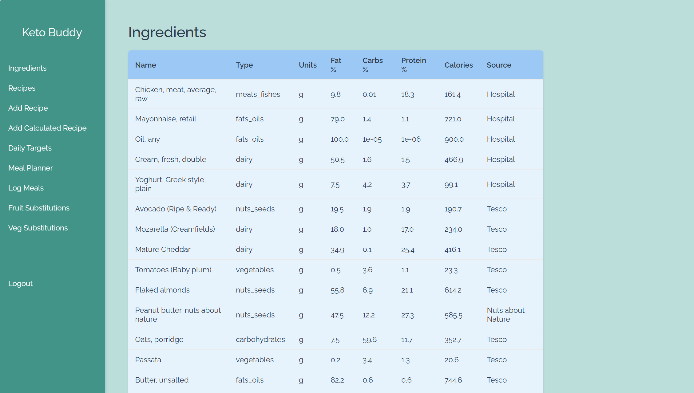
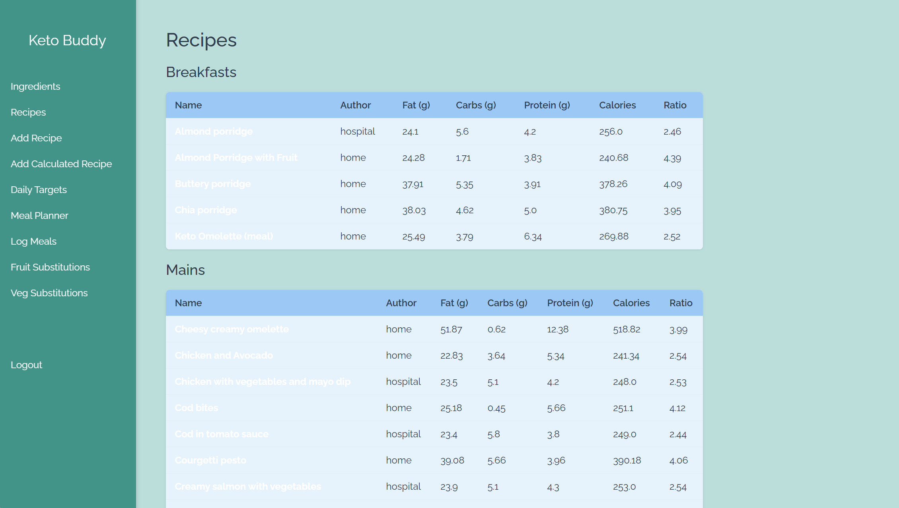
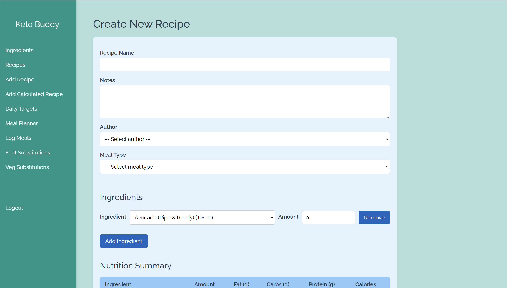
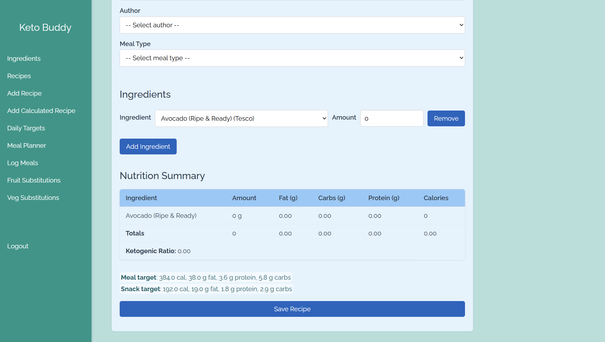
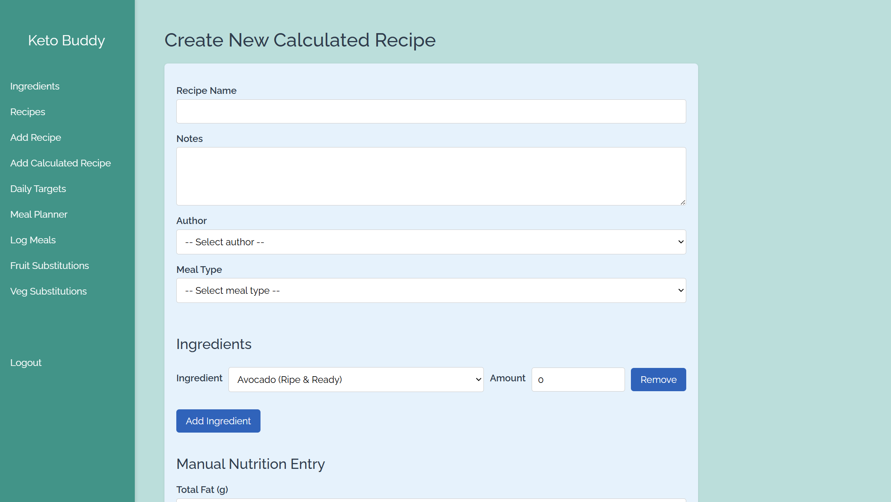
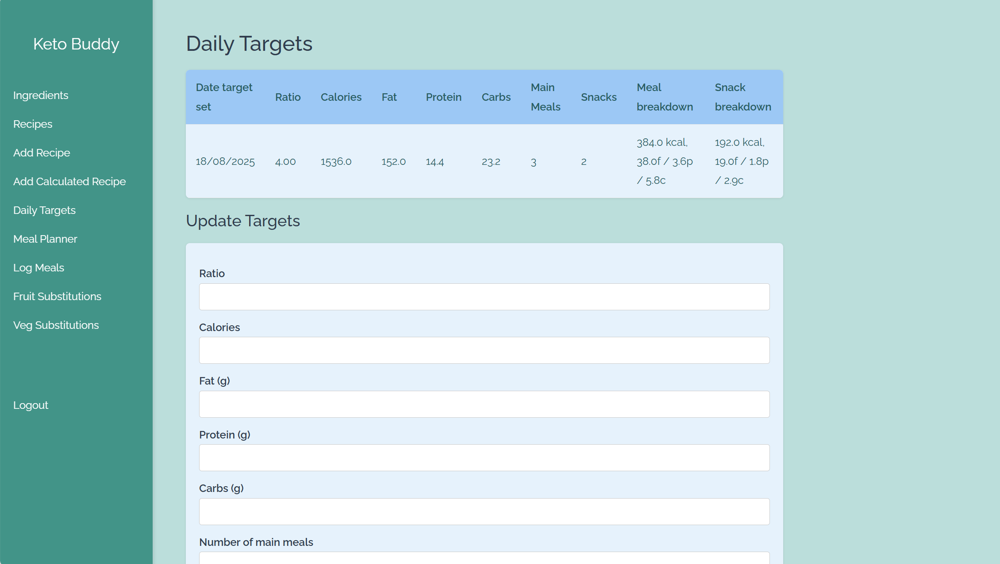
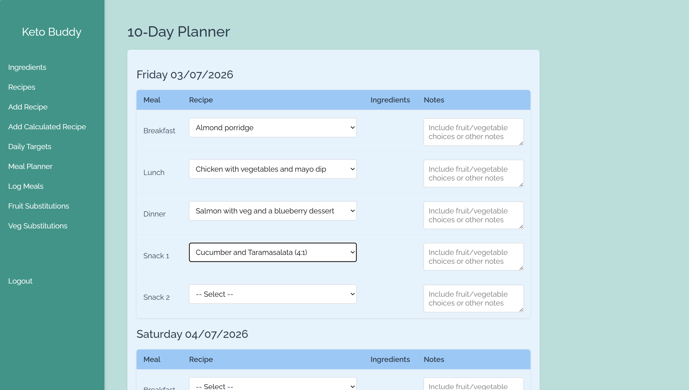
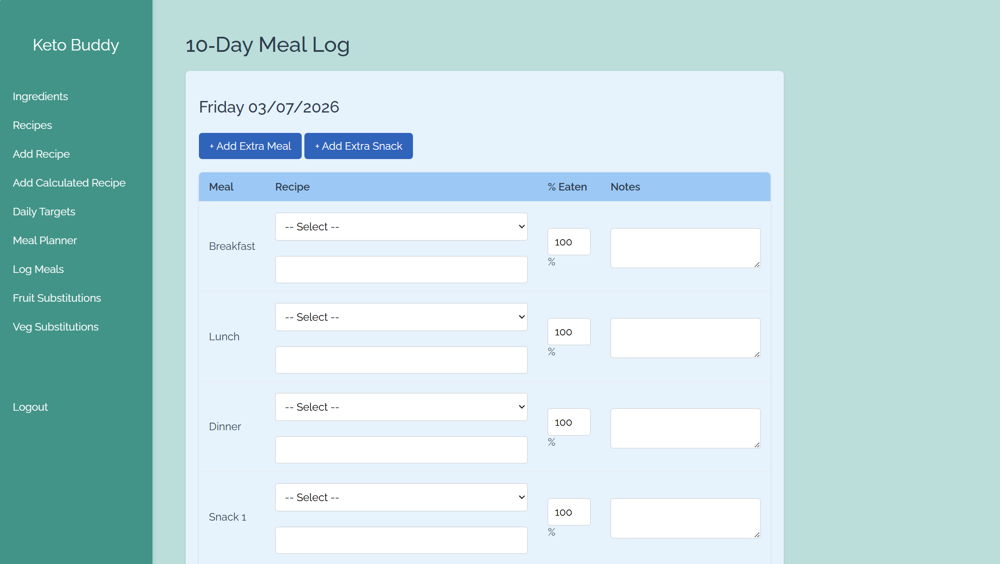
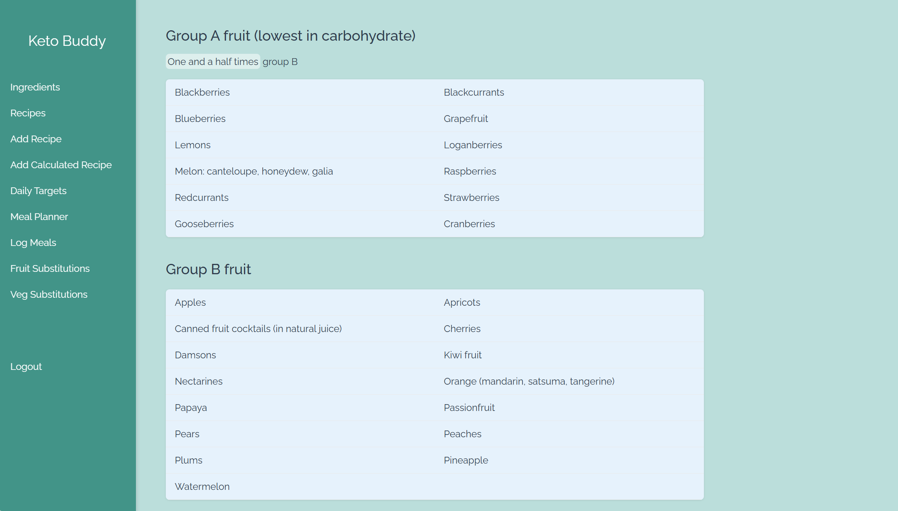
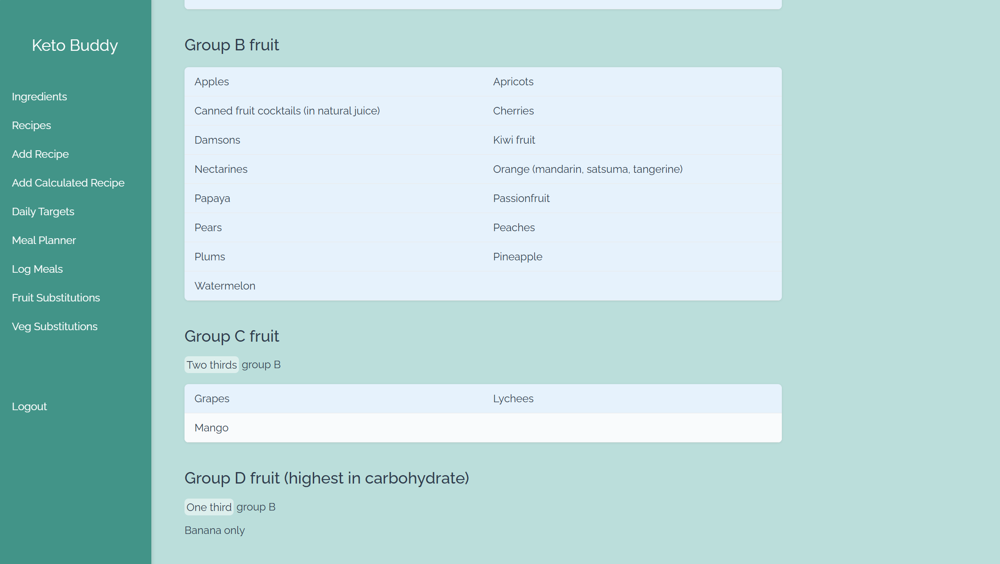
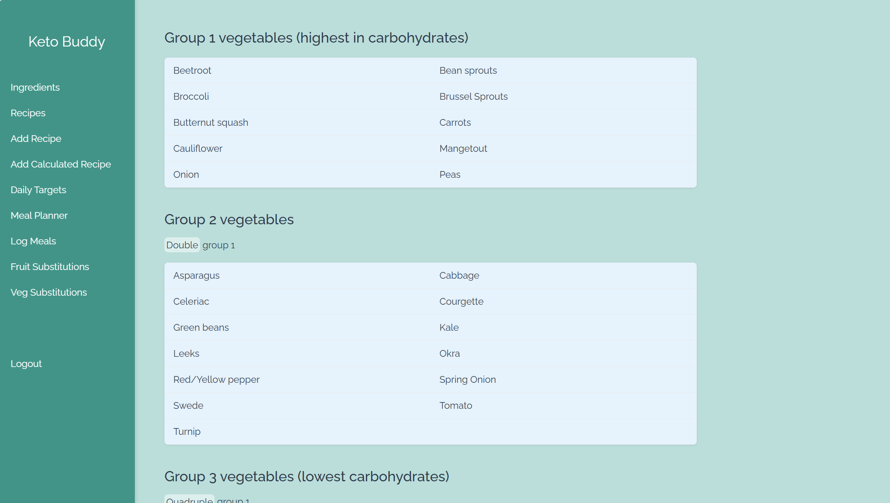
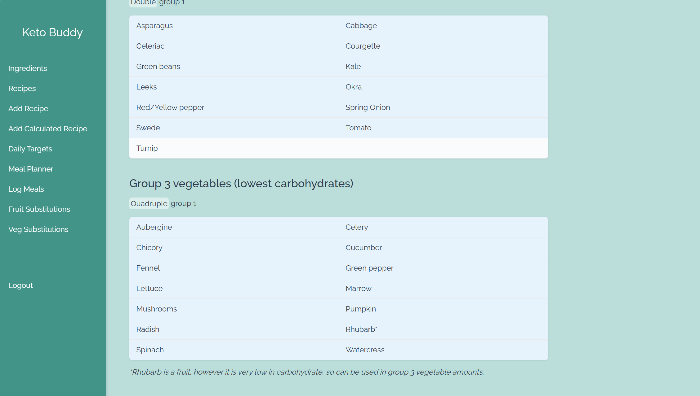

## Stack
- Javascript, Flask, SQLAlchemy

## Deployment
- Run locally
    - Clone repo & `uv sync` for dependency install
    - You will need to create a .env file with a suitable `FLASK_SECRET_KEY`
    - `python run.py`
- Live deployment on Heroku via Gunicorn + Heroku Postgres as per the Procfile
    - Tutorials [here](https://blog.miguelgrinberg.com/post/the-flask-mega-tutorial-part-xviii-deployment-on-heroku) and [here](https://www.codecademy.com/article/deploying-a-flask-app) but note that we are [using the new heroku support for uv](https://www.heroku.com/blog/local-speed-smooth-deploys-heroku-adds-support-uv/) i.e. we have a `pyproject.toml` rather than a `requirements.txt`
- `config.py` handles switching between connecting to either a remote (Postgres) or local (SQLite) DB

## Disclaimer

Some vibe coding was used in this project!